# Likelion 11th Hackathon 3team
<<<<<<< HEAD
# 써핑
정보검색시간 최소화와 정보 질 향상을 위해 다양한 검색엔진에서 활용할 수 있는 기능을 게임을 통해 학습하는 교육 서비스<br />
<br />
20대 남녀 대학생이 정보 검색 시 느끼는 어려움과 불편을 해결합니다.
=======

# Project Name

프로젝트설명

>>>>>>> develop
## 웹개발팀 소개

|                 김아영                 |                    안지유                    |                  오현의                  |
| :------------------------------------: | :------------------------------------------: | :--------------------------------------: |
| [@ahyexng](https://github.com/ahyexng) | [@zzzzzuuuuu](https://github.com/zzzzzuuuuu) | [@hyunyeee](https://github.com/hyunyeee) |

## 시작가이드

### Installation

```bash
$ git clone https://github.com/mju-likelion/hackathon-team3-web.git
$ cd (파일명)
$ yarn install
$ yarn start
```

---

## Stacks 🐈

### Environment


### Config


### Development


### Communication


---

## 화면 구성 📺

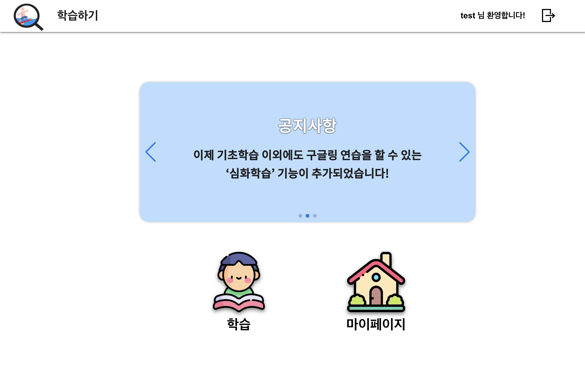
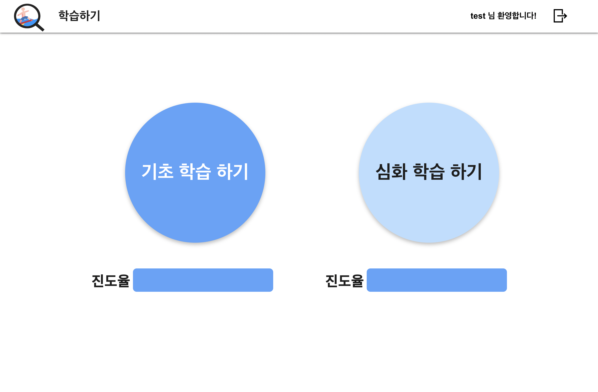
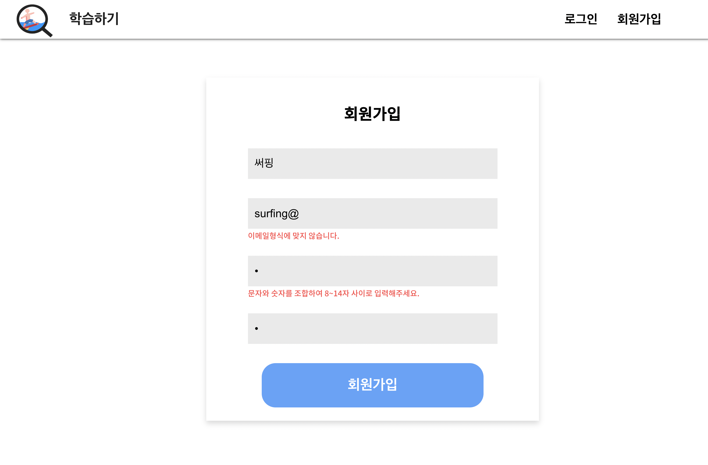
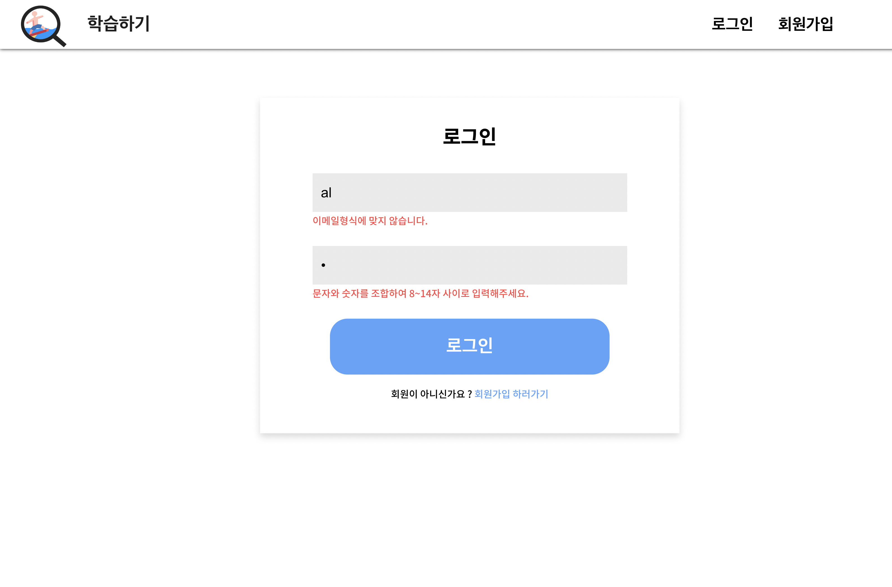
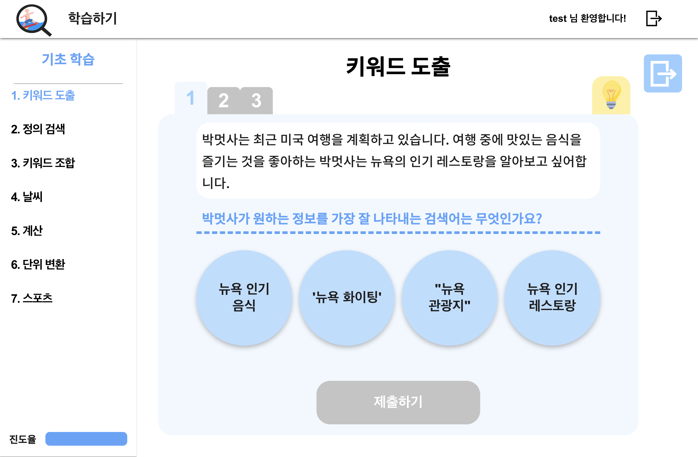
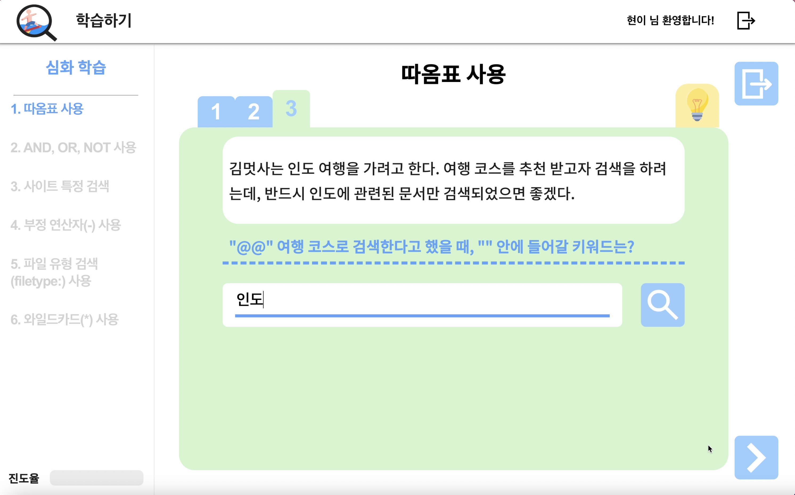
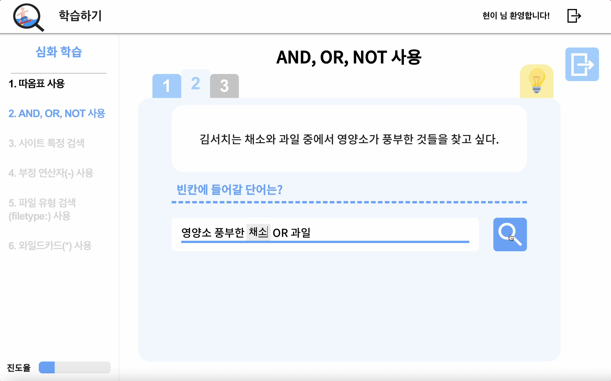
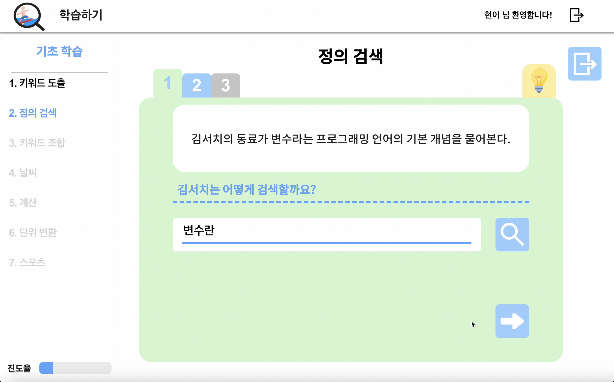
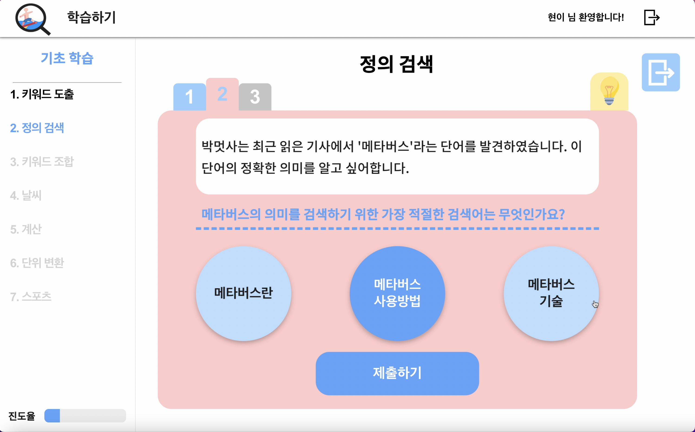
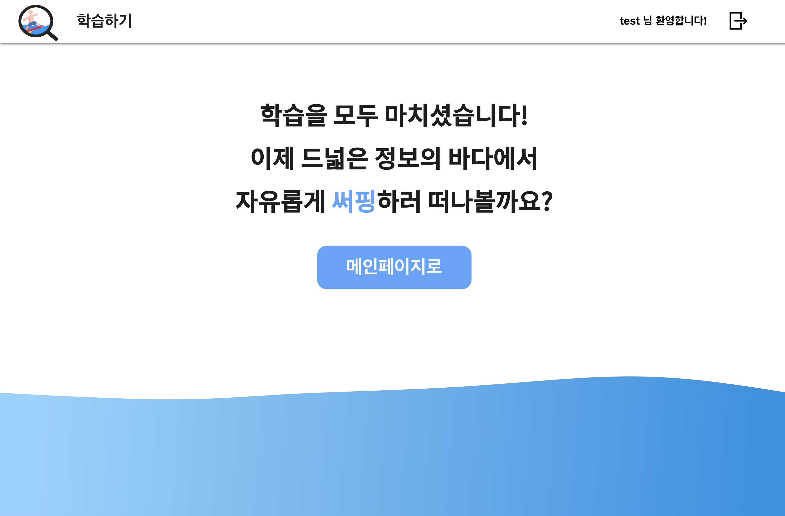
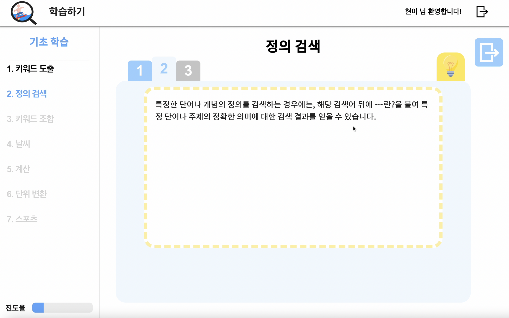
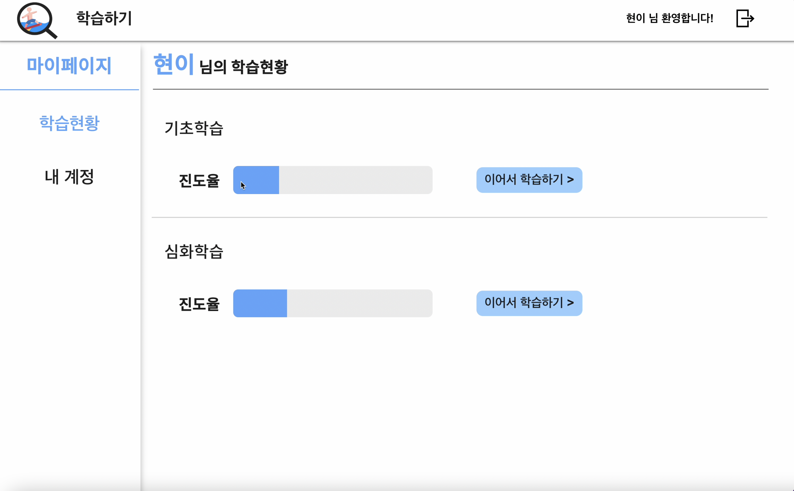
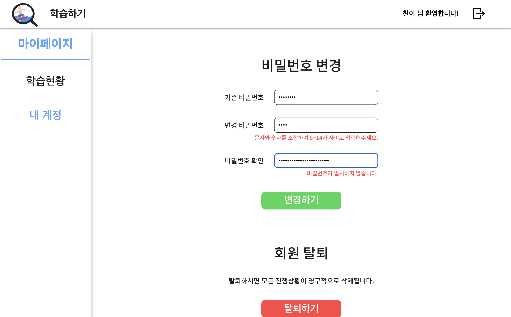
## 주요 기능 📦

---

## Convention ✅

### Branch Naming Convention 🪵

| 머릿말  | 설명                               |
| ------- | ---------------------------------- |
| master  | 서비스 브랜치                      |
| develop | 배포 전 작업 기준                  |
| feature | 기능 단위 구현                     |
| hotfix  | 서비스 중 긴급 수정 건에 대한 처리 |

### Commit Convention 🚥

| 머릿말   | 설명                                   |
| -------- | -------------------------------------- |
| feat     | 기능 구현, 추가                        |
| setting  | 패키지 설치, 개발 설정                 |
| refactor | 코드 리팩터링                          |
| style    | 스타일 수정                            |
| fix      | 버그 수정, 예외 케이스 대응, 기능 개선 |
| test     | 테스트 코드 추가                       |
| docs     | README.md작성 및 변경                  |

---

## 폴더 구조

```
.
├──📝 App.js, index.js, ...
│
├──🗂 api
│   ├──📃 Axios.js
│   ├──📂 Auth
│   └──📂 Game  
│     
├──🗂 components
│   ├── 📃 Header.js
│   ├── 📃 Input.js
│   ├── 📃 ProgressRateBar.js
│   │
│   ├──📂 Button
│   ├──📂 Game
│   ├──📂 Main
│   └──📂 MyPage
├── 📂 src
│    ├── 📂 assets
│    │   ├── 📂 data
│    │   └── 📂 images
│    ├── 📂 components
│    ├── 📂 pages
│    │   ├── 📂 Content
│    │   ├── 📂 Join
│    │   ├── 📂 Login
│    │   ├── 📂 Main
│    │   └── 📂 Post
│    └── 📂 styles
│
├──🗂 pages
│   ├──📂 Education
│   ├──📂 Main
│   ├──📂 MyPage
│   ├──📂 Login
│   ├──📂 Join
│   └──📂 Error
│
├──🗂 hooks
│
├──🗂 assets
│   └──📂 images
│
└──🗂 styles
```
